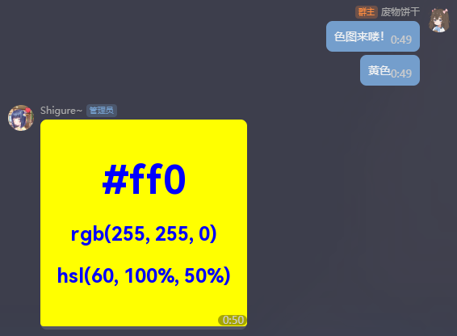

<!-- markdownlint-disable MD031 MD033 MD036 MD041 -->

<div align="center">

<a href="https://v2.nonebot.dev/store">
  
</a>

<p>
  
</p>

# NoneBot-Plugin-Color

_✨ 用于生成指定色彩图片的 NoneBot2 插件 ✨_


<a href="https://pdm.fming.dev">
  
</a>

<br />

<a href="./LICENSE">
  
</a>
<a href="https://pypi.python.org/pypi/nonebot-plugin-color">
  
</a>
<a href="https://pypi.python.org/pypi/nonebot-plugin-color">
  
</a>

</div>

## 💿 安装

以下提到的方法 任选**其一** 即可

<details open>
<summary>[推荐] 使用 nb-cli 安装</summary>
在 nonebot2 项目的根目录下打开命令行, 输入以下指令即可安装

```bash
nb plugin install nonebot-plugin-color
```

</details>

<details>
<summary>使用包管理器安装</summary>
在 nonebot2 项目的插件目录下, 打开命令行, 根据你使用的包管理器, 输入相应的安装命令

<details>
<summary>pip</summary>

```bash
pip install nonebot-plugin-color
```

</details>
<details>
<summary>pdm</summary>

```bash
pdm add nonebot-plugin-color
```

</details>
<details>
<summary>poetry</summary>

```bash
poetry add nonebot-plugin-color
```

</details>
<details>
<summary>conda</summary>

```bash
conda install nonebot-plugin-color
```

</details>

打开 nonebot2 项目根目录下的 `pyproject.toml` 文件, 在 `[tool.nonebot]` 部分的 `plugins` 项里追加写入

```toml
[tool.nonebot]
plugins = [
    # ...
    "nonebot_plugin_color"
]
```

</details>

## ⚙️ 配置

无

## 🎉 使用

插件基于 `pydantic` 的 `Color` 类解析颜色，详见 [这里](https://docs.pydantic.dev/1.10/usage/types/#color-type)  
当发送符合其格式的消息时，Bot 将会回复你一张颜色图片

也可以作为指令 `color` / `色图` 的参数来使用

例子：

- 颜色别名：`yellow` / `黄` / `黄色`（插件对中文颜色别名做了特殊处理，支持的名称列表见 [const.py](./nonebot_plugin_color/const.py)）
- 十六进制（HEX）：`#ff0` / `#ff0f` / `#ffff00` / `#ffff00ff`
- CSS RGB / RGBA：`rgb(255, 255, 0)` / `rgba(255, 255, 255, 1)`
- CSS HSL：`hsl(60, 100%, 50%)` / `hsl(60, 100%, 50%, 1)`

<details>
<summary><i>哎哟这个色啊！好色！</i></summary>



</details>

## 💡 鸣谢

- [@nonebot/nonebot2](https://github.com/nonebot/nonebot2/)
- [@nonebot/plugin-alconna](https://github.com/nonebot/plugin-alconna)
- [@Mrs4s/go-cqhttp](https://github.com/Mrs4s/go-cqhttp)
